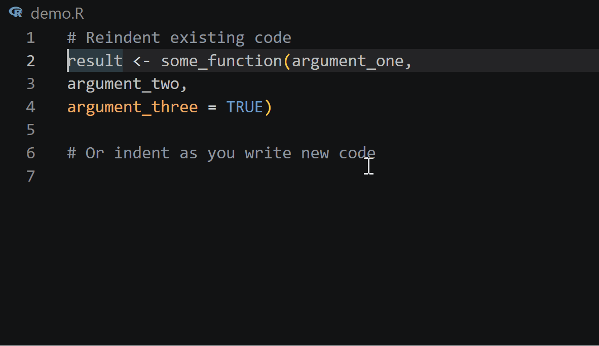

# R Reindent Lines

A VSCode extension that brings RStudio's **"Vertically align arguments in
auto-indent"** behaviour to R, Quarto (`.qmd`), and R Markdown (`.Rmd`) files.

## What it does



Reindents selected lines (or the current line) so function arguments align to
the column immediately after the opening bracket — exactly as RStudio's
`Ctrl+I` / `Cmd+I` "Reindent Lines" command behaves with vertical alignment
enabled.

```r
# Before
result <- some_function(argument_one,
argument_two,
argument_three = TRUE)

# After
result <- some_function(argument_one,
                        argument_two,
                        argument_three = TRUE)
```

Pipe chains are handled correctly — all steps share a single indent level:

```r
mtcars |>
  filter(cyl == 4) |>
  group_by(am) |>
  summarise(mpg = mean(mpg),
            wt  = mean(wt))
```

Comments between pipe steps are transparent (inherit the chain's indent).
`} else {` / `} else if` blocks align both branches to the same base indent.

For `.qmd` and `.Rmd` files, **only R code blocks are touched** — prose,
YAML front matter, and non-R fences are left completely unchanged.

Coding styles using leading operators are also handled:

```r
(mtcars
  |> filter(cyl == 4)
  |> group_by(am)
  |> summarise(mpg=mean(mpg),
               wt=mean(wt)))
```

If a line is manually intended for some reason, then following lines
defer to the established indentation level:

```r
ThisIsAnExtremelyLongFunctionName <- AnotherLongFunctionName(
                                                argument1 + # manual indent
                                                  part_of_arg1,
                                                argument2)
```


## Usage

| Action | Shortcut |
|---|---|
| Reindent selection (or current line) | `Ctrl+I` / `Cmd+I` |
| Command Palette | `R: Reindent Lines` |
| Right-click context menu | `R: Reindent Lines` |
| Format Selection (VSCode built-in) | `Shift+Alt+F` / `Ctrl+K Ctrl+F` |

**With a selection:** only the selected lines are reindented (full lines,
expanded from the selection).

**Without a selection:** only the current line is reindented.

Consider also binding to the TAB key, for Emacs ESS-like behavior.

## Settings

| Setting | Default | Description |
|---|---|---|
| `r-reindent.verticalAlign` | `true` | Align arguments to column after `(`. Set `false` for one-tab-stop mode. |
| `r-reindent.tabWidth` | `2` | Spaces per indent level. |

## Installation (from source)

```bash
# 1. Clone / copy the extension folder
cd r-reindent

# 2. Install dependencies
npm install

# 3. Compile
npm run compile

# 3b. Run tests (optional)
npm run test

# 4a. Press F5 in VSCode to launch the Extension Development Host, OR
# 4b. Package for distribution:
npm install -g @vscode/vsce
vsce package          # produces r-reindent-0.1.3.vsix
code --install-extension r-reindent-0.1.3.vsix
```
